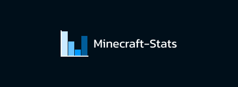

# [Minecraft Stats](https://minecraft-stats.fr)

Minecraft-Stats is a website that allows you to track players amount statistics in more than 70 differents servers. If the server is not listed, you can add it instantly. We store all the data, so you can see the evolution of your server.

## Why use our website?

- We save all data, we don't clear it after a certain time.
- You can add your server instantly.

## Next Objectives

- [X] Add a better API documentation
- [ ] Add a way to get an API key sync to account
- [ ] Add French translations
- [X] Add security to the API (Rate limit)
- [ ] Add possibility to find server by langage : FR / US / INTER / ALL
- [ ] and more...

You can contribute to the project by reporting issues, suggesting new features, or submitting pull requests on GitHub.

